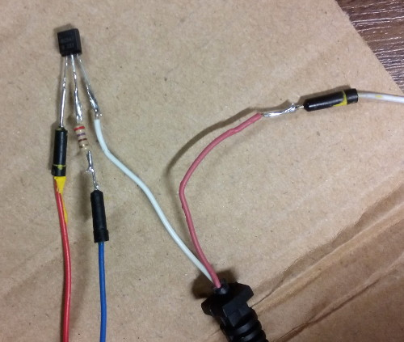

Build Alarm
===========

A small build alarm program to connect Jenkins to an alarm light.

1. Program Arduino
------------------

Requirements (on ArchLinux)::

    # Needed for the arduino
    $ sudo pacman -S avrdude avr-gcc avr-binutils avr-libc
    $ yaourt -S arduino

    # Needed for the Makefile
    $ sudo pacman -S make perl-device-serialport perl-yaml

Clone and initialize submodules::

    $ git submodule init
    $ git submodule update

Build and upload::

    $ cd arduino
    $ make upload

2. Wiring
---------

We use a transistor for switching the lamp on and off.

Connect the wires as follows:

:Red: 5V
:White: GND
:Blue: Pin 8
